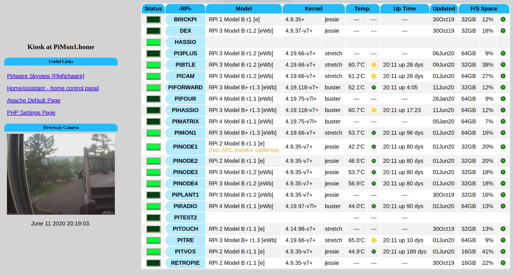

# RPi-scripts
### a Dashboard for monitoring your Raspberry Pi Constellation
RPi monitoring, control system, and data reporting

Have you been wanting to maintian an overview of all the RPi's you have running in your house?  Well with this setup of scripts you can set one up for yourself!

## Features

- Syncing scripts to constellation-member RPi's (from central RPi)
- Reporting hardware / OS state to central RPi
- PHP scripts for showing state of RPi Constellation in Kiosk mode at backend of central RPi

----

### [Copyright](copyright) | [License](LICENSE)
